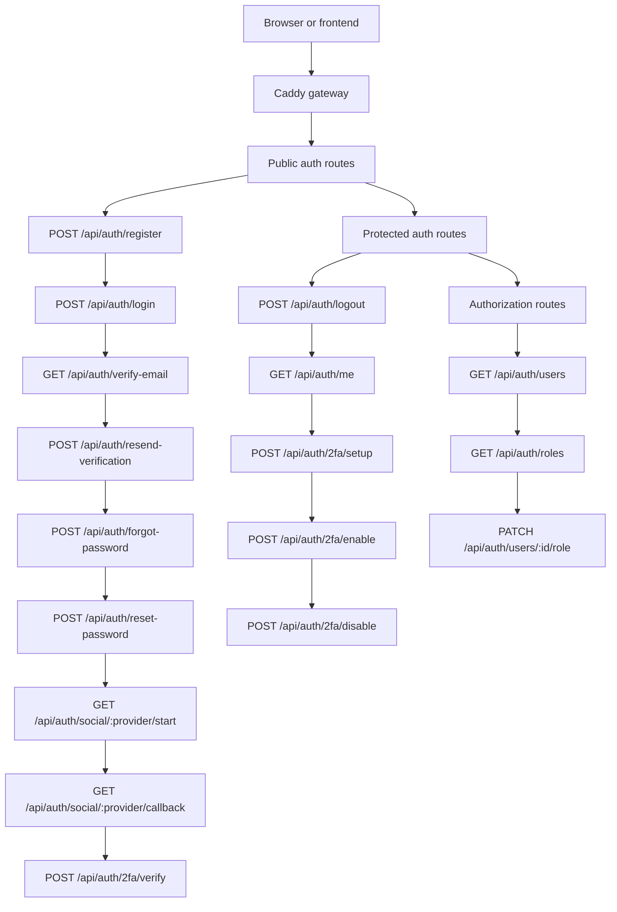
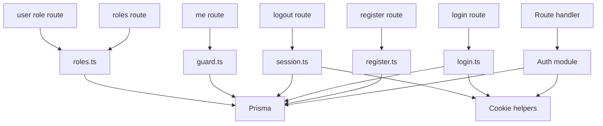

# Adjeuken Part

## Scope

This document describes the auth work I took ownership of in this project.

For Phase 1, my goal was not to build the full auth feature set yet. The goal was to isolate auth as a clear subsystem inside `nextApp` so it can evolve cleanly later.

## What I Changed

I reorganized auth around a dedicated boundary:

- auth routes under `nextApp/src/app/api/auth/`
- auth module files under `nextApp/src/modules/auth/`
- shared auth contracts under `packages/contracts/auth/`
- auth-specific Prisma models in `nextApp/prisma/schema.prisma`

I also kept the deployment unchanged:

- no new container
- no Caddy change
- no `docker-compose.yml` change

## Auth Route Map

The lines below group the endpoints by area. They do not represent execution order.



## Implemented Flow



## Phase 1 Result

The auth domain is now separated logically even though it still runs inside the same backend container.

What is already working:

- register
- login
- logout
- `/me`
- users listing
- roles listing
- user role update
- session cookie handling
- auth guard structure

What is now exposed but not fully implemented yet:

- email verification
- resend verification
- forgot password
- reset password
- social login
- 2FA

Those routes exist now because I wanted the auth surface to be complete in structure first. The feature logic behind some of them is still placeholder logic and will be implemented in the next phase.

## Endpoint Responsibilities

These are the backend responsibilities for each route.

### Core routes already working

- `POST /api/auth/register`
  Creates a local user, hashes the password, stores the user in the database, and returns the created auth user DTO.
- `POST /api/auth/login`
  Validates email and password, creates a session record, and sends the session cookie.
- `POST /api/auth/logout`
  Revokes the current session and clears the auth cookie.
- `GET /api/auth/me`
  Reads the session cookie, resolves the authenticated user, and returns the current profile.
- `GET /api/auth/users`
  Returns the user list for admin access.
- `GET /api/auth/roles`
  Returns the supported role list.
- `PATCH /api/auth/users/:id/role`
  Lets an admin update a user's role.

### Routes prepared for the next backend phase

- `GET /api/auth/verify-email`
  Will validate the verification token and mark the email as verified.
- `POST /api/auth/resend-verification`
  Will issue or resend a verification token.
- `POST /api/auth/forgot-password`
  Will create a password reset request.
- `POST /api/auth/reset-password`
  Will validate the reset token and update the password.
- `GET /api/auth/social/:provider/start`
  Will start the OAuth flow for the selected provider.
- `GET /api/auth/social/:provider/callback`
  Will validate the OAuth callback and link or log in the user.
- `POST /api/auth/2fa/setup`
  Will generate the 2FA secret and setup payload.
- `POST /api/auth/2fa/enable`
  Will confirm the 2FA setup code and enable 2FA.
- `POST /api/auth/2fa/verify`
  Will verify the second factor during login.
- `POST /api/auth/2fa/disable`
  Will disable 2FA for the authenticated user after verification.

## Files I Focused On

Main backend area:

- `nextApp/src/app/api/auth/`
- `nextApp/src/modules/auth/`
- `nextApp/prisma/schema.prisma`

Shared contracts:

- `packages/contracts/auth/`

Related updates:

- `nextApp/src/modules/user/service.ts`
- `frontend/src/hooks/useUsers.ts`
- `nextApp/src/hooks/useUsers.ts`
- `.github/workflows/ci.yml`
- `scripts/ci-auth-smoke.sh`

## Prisma Changes

I extended the schema to support the next auth steps by adding:

- `email_verified_at` on `users`
- `EmailVerificationToken`
- `PasswordResetToken`
- `OAuthAccount`
- `TwoFactorCredential`

This keeps the DB ready for the next auth features without requiring a later redesign.

## Why I Did It This Way

I wanted to keep the first step low risk.

Instead of extracting auth into a separate service immediately, I first isolated it inside the current backend. That gives:

- lower migration cost
- clearer ownership
- easier review by the team
- a cleaner future path if auth is extracted later

## Validation

I rebuilt the stack from scratch and checked the auth flow after the refactor.

Commands used:

```bash
make fclean
make dev
bash scripts/ci-auth-smoke.sh
```

What I verified:

- containers build and start correctly
- database migrations run
- seeded admin login works
- `/api/auth/me` works
- `/api/auth/users` works
- `/api/auth/roles` works
- role update works

## Current Status

Phase 1 is complete as a structural refactor.

That means the auth subsystem is now isolated and stable enough to build on.

The next phase is to replace the placeholder auth routes with real feature logic for:

- email verification
- password recovery
- social login
- 2FA
