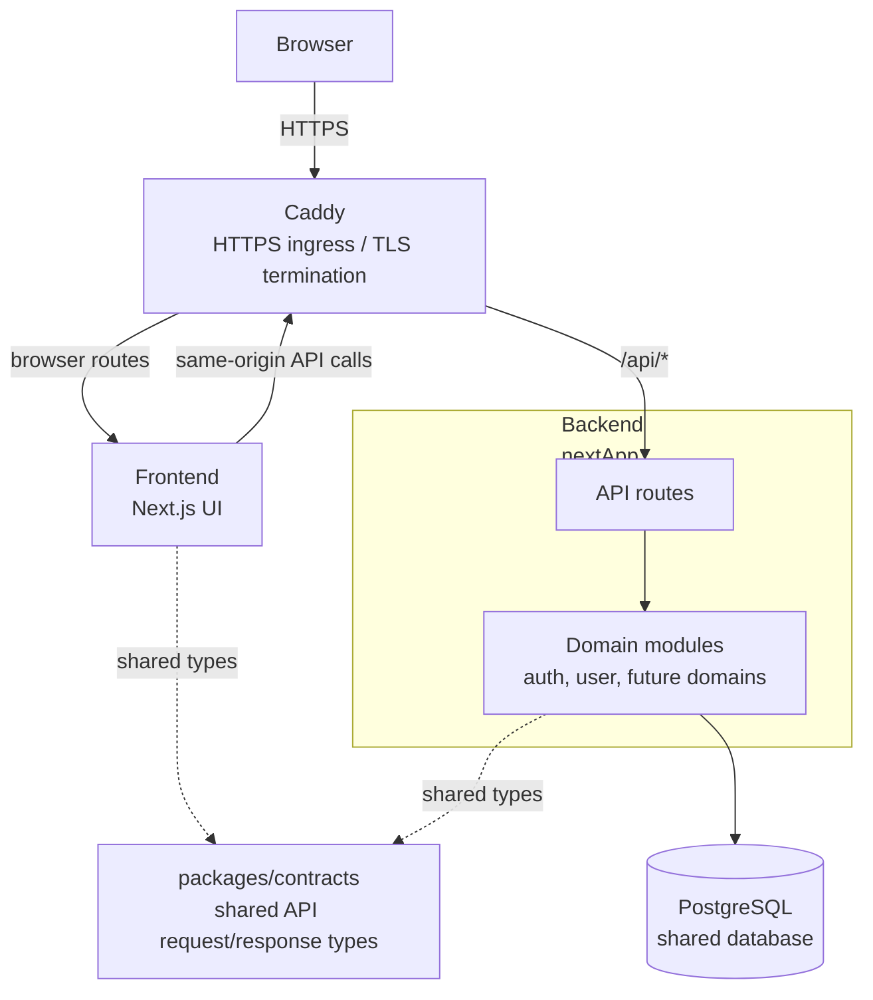
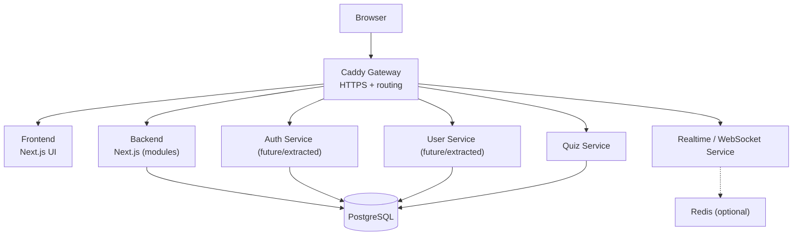

# Service Integration Guide (v1)

## Purpose

This document explains how to add and connect a new service or domain in the current project.

It is a practical guide for contributors:

- what exists today
- where new code should go
- how to wire it through the system

It is not a separate target-system proposal.

## Current System Overview

The repository is currently structured as:

- `caddy/` -> public gateway, HTTPS, TLS termination, routing
- `frontend/` -> Next.js frontend application
- `nextApp/` -> Next.js backend application for API routes and business logic
- `database` -> shared PostgreSQL instance
- `packages/contracts/` -> shared API request and response types

Key rule:
all external traffic goes through Caddy.

## Current Repo Mapping

- `frontend/` contains browser pages and client-side modules
- `nextApp/src/app/api/` contains backend API routes
- `nextApp/src/modules/` contains backend domain logic
- `packages/contracts/` contains shared API contracts
- `caddy/Caddyfile` defines public routing rules
- `docker-compose.yml` wires the running services together

Current routing:

- browser routes -> `frontend`
- `/api/*` -> `backend`
- `/health` -> gateway health endpoint

## Core Rules

### 1. Keep domain boundaries clear

Each feature should belong to a clear domain boundary.

Examples:

- auth
- user
- quiz
- content

Do not add unrelated domain logic inside another domain just because it is convenient.

### 2. Contracts are shared, not behavior

All shared API request and response shapes must live in:

```text
packages/contracts/
```

Contracts may contain:

- request types
- response types
- DTOs
- shared API-facing enums and simple types

Contracts must not contain:

- hooks
- fetch logic
- React state
- Prisma logic
- cookie or session implementation

### 3. The gateway is the only public entrypoint

Services are exposed through Caddy, not by direct container ports.

Public API paths should follow:

```text
/api/<service-name>/*
```

Examples:

- `/api/auth/*`
- `/api/user/*`
- `/api/quiz/*`

Note:
some existing backend routes are transitional and do not yet follow the final naming pattern exactly. Keep current routes stable unless you are explicitly doing an API migration.

### 4. Backend logic lives in modules or services, not in route handlers

Route handlers should stay thin:

- parse input
- call module or service code
- return a response

Business logic belongs in backend-owned code such as:

- `nextApp/src/modules/<domain>/`
- later, if extracted, `services/<domain>/`

### 5. Frontend always goes through the gateway

Frontend code should call same-origin API paths such as:

```ts
fetch("/api/quiz/submit", ...)
```

Do not call backend containers directly from browser code.

## Architecture Direction

New domains do not need to start as standalone services.

There are two valid implementation stages:

- `nextApp/src/modules/<domain>/`
  Use this when the feature is still evolving, when you want the smallest-risk change, or when the domain still fits comfortably inside the current backend.
- `services/<domain>/`
  Use this when the domain already has a stable boundary, needs separate deployment concerns, or is ready for real extraction.

In both cases:

- contracts stay in `packages/contracts/`
- browser traffic still goes through Caddy
- public API paths should remain consistent

This means service extraction is an evolution of the current architecture, not a separate architecture.

## How To Add a New Service or Domain

### Step 1. Choose where the new domain starts

Use `nextApp/src/modules/<domain>/` when:

- the feature is new or still changing quickly
- it shares the current backend deployment
- you want the smallest implementation risk

Use `services/<domain>/` when:

- the domain boundary is already clear
- the service needs separate deployment or scaling
- the team is intentionally extracting it from the backend

Example module-first structure:

```text
nextApp/src/modules/quiz/
  service.ts
```

Example extracted-service structure:

```text
services/quiz/
  Dockerfile
  package.json
  src/
```

### Step 2. Define contracts

Add shared API types in:

```text
packages/contracts/
```

Example:

```ts
export type SubmitAnswerRequest = {
  sessionId: string;
  answerId: number;
};

export type SubmitAnswerResponse = {
  correct: boolean;
};
```

Frontend and backend code should both import these shared types instead of redefining them locally.

### Step 3. Implement backend logic

If the domain starts inside `nextApp`:

- add backend logic under `nextApp/src/modules/<domain>/`
- keep route handlers thin
- have route handlers call the module service

If the domain starts as an extracted service:

- implement the service in `services/<domain>/`
- keep its own handlers and business logic inside that service

### Step 4. Expose API routes

If the domain stays inside `nextApp`:

- add routes under `nextApp/src/app/api/`
- keep the current backend routing shape

If the domain is extracted:

- expose internal routes inside the service
- let Caddy publish them under `/api/<service-name>/*`

Example internal endpoints:

- `POST /submit`
- `GET /session/:id`

### Step 5. Add runtime wiring

If the domain stays inside `nextApp`:

- no new Compose service is required
- no new Caddy route is required if it remains under the generic backend `/api/*` handling

If the domain is extracted:

- add a new service to `docker-compose.yml`
- connect it to the existing network

Example:

```yaml
quiz:
  build: ./services/quiz
  container_name: quiz
  networks:
    - transnet
```

### Step 6. Connect it in Caddy when needed

Only extracted services need a dedicated Caddy route.

Example:

```caddyfile
handle_path /api/quiz/* {
    reverse_proxy quiz:3000
}

@api path /api/*
handle @api {
    reverse_proxy backend:3000
}
```

Important:
more specific service routes must appear before the generic backend `/api/*` handler.

### Step 7. Use it from the frontend

Frontend code should always go through the gateway:

```ts
fetch("/api/quiz/submit", ...)
```

This keeps browser code stable whether the domain is still inside `nextApp` or already extracted.

### Step 8. Verify the integration

After wiring a new domain:

```bash
docker compose up --build -d
curl -vk https://localhost:8443/health
```

Then verify:

- the frontend page that uses the feature
- or the API route through Caddy

## Database Rules

Current state:

- one shared PostgreSQL instance

Rules:

- each domain owns its own tables
- do not modify another domain's tables without an explicit migration plan
- do not import another domain's Prisma models or data-access code
- do not bypass domain boundaries just because the database is shared

The database is shared operationally today, but data ownership should still stay separated by domain.

## Redis

Redis is optional and not required for adding a new domain right now.

Possible future uses:

- sessions
- caching
- pub/sub
- transient state

Do not introduce Redis unless the service has a clear need for it.

## What Not To Do

Do not:

- add business logic in Caddy
- bypass `packages/contracts`
- put hooks, fetch code, or Prisma code in shared contracts
- access another domain's data directly
- call backend containers directly from frontend code
- mix unrelated domain logic into an existing module or service
- redesign working routes as part of an unrelated feature addition

## Existing Services Mapping

Current code already maps cleanly to this structure:

- auth -> `nextApp/src/modules/auth`
- user -> `nextApp/src/modules/user`
- frontend UI -> `frontend/src/app`
- shared contracts -> `packages/contracts`
- gateway -> `caddy/Caddyfile`

Auth and user are backend modules today. They are the first candidates for later extraction if the project needs it.

## Current Architecture Diagram




## Target Architecture Diagram

