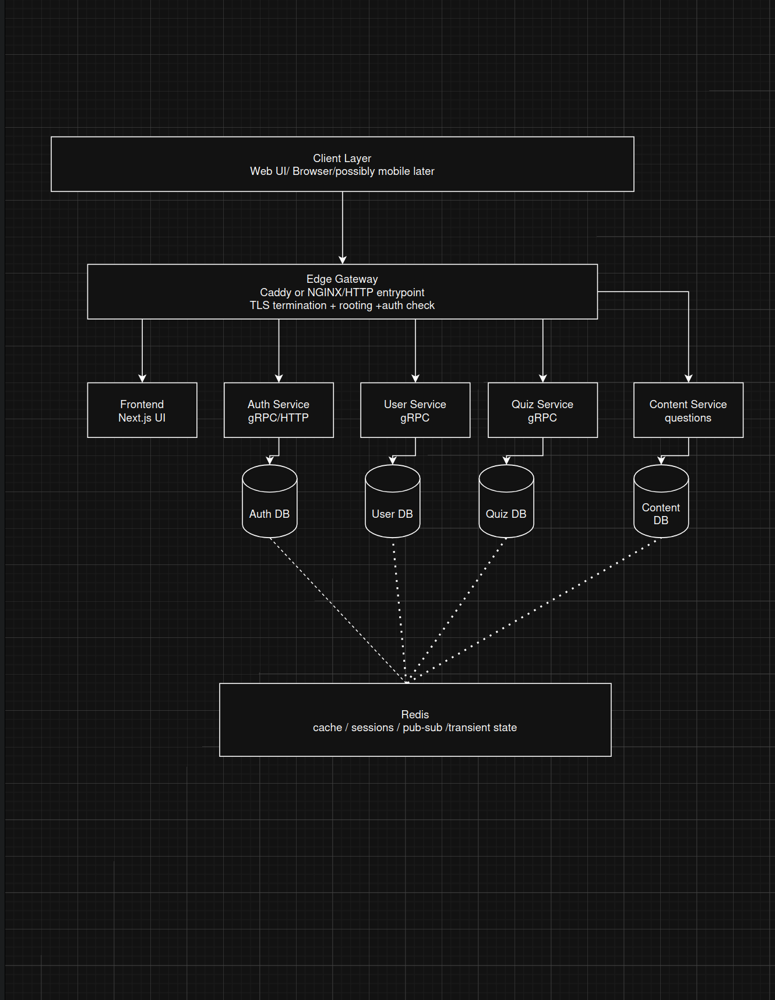

# Target Microservice Architecture (v0)

## Purpose
This document describes the target architecture of the project and how it relates to the current repository state. It serves as a reference for organizing the system and guiding future evolution.

---

## Current implementation state
The current repository is not yet a full microservice system.

At the moment:
- the application runs as a single Next.js service
- Caddy is used as the HTTP entrypoint (reverse proxy)
- PostgreSQL is used as the main database
- Prisma is present for database access
- the frontend uses the App Router structure (`src/app`)
- the current homepage is still close to the default Next.js starter page
- some auth/user-related support code already exists in `src/lib` and `src/hooks`

---

## Target architecture
The target architecture separates the system into logical domains while keeping a simple deployment at the beginning:

- Edge Gateway (Caddy)
- Frontend Service (Next.js)
- Auth domain
- User domain
- Quiz domain
- Content domain
- PostgreSQL (initially shared)
- Redis as shared infrastructure (optional later)
- REST APIs for communication

The goal is to define clear boundaries first, and only split into separate services when needed.

---

## Component responsibilities

### Client Layer
The client layer represents the browser-based user interface. Clients communicate only through the Edge Gateway.

### Edge Gateway (Caddy)
Caddy acts as the public entrypoint of the system. It is responsible for:
- HTTP/HTTPS handling
- TLS termination
- request routing
- forwarding headers

It should remain thin and must not contain business logic.

### Frontend Service (Next.js)
The Frontend Service provides the user interface and handles client interactions. It also currently hosts backend logic through API routes. This service acts as a combined frontend/backend during early development.

### Auth Domain
Responsible for authentication and identity-related operations such as registration, login, logout, and session validation.

### User Domain
Responsible for user profiles, account-related operations, and administrative user management.

### Quiz Domain
Responsible for quiz execution, session lifecycle, scoring, and game-related logic.

### Content Domain
Responsible for question banks, categories, and content management.

### Database (PostgreSQL)
Currently a single shared database. In a full microservice architecture, each service would own its own data, but this separation is not required at the beginning.

### Redis (optional)
Used for caching, sessions, or transient state if needed later. Not required for the initial implementation.

---

## Communication model
- Clients communicate with the system via HTTPS through Caddy.
- Caddy routes requests to the Next.js application.
- Internal communication is currently handled within the same application.
- Future service-to-service communication will use REST APIs.
- Each domain should conceptually own its data, even if the database is shared initially.

---

## Mapping from current repo to target architecture
The current repository can be understood as a baseline that will evolve toward the target architecture.

Rough mapping:
- Caddy -> Edge Gateway
- current Next.js app -> frontend + backend combined service
- auth/user logic in `src/lib` and `src/hooks` -> future domain separation
- Prisma/PostgreSQL -> initial shared persistence layer

---

## Evolution strategy
- Step 1: Keep a single application (Next.js + Postgres)
- Step 2: Organize code by domain (auth, user, quiz, content)
- Step 3: Define clear API boundaries (REST)
- Step 4: Extract services only when needed

---

## Diagram

::: mermaid
flowchart TB
    Browser[Browser]
    Caddy["Caddy\nHTTPS ingress / TLS termination\nReverse proxy :8080/:8443"]

    subgraph NextApp["Next.js Modular Monolith"]
        direction TB

        UI["Browser UI\n/\n/login\n/profile\n/admin/users\n/swagger"]

        subgraph ApiLayer["API Routes"]
            direction TB
            AuthAPI["Auth API\nPOST /api/auth/register\nPOST /api/auth/login\nPOST /api/auth/logout\nGET /api/auth/me\nPOST /api/auth/password"]
            UserAPI["User / Profile API\nPUT /api/auth/:id\nDELETE /api/auth/:id\nGET /api/auth/me"]
            AdminAPI["Admin / User Management API\nGET /api/auth/users\nPUT /api/auth/:id\nDELETE /api/auth/:id"]
            DocsAPI["API Docs\nGET /api/docs\n/swagger"]
        end

        subgraph AppLogic["Application / Domain Logic"]
            direction LR
            AuthMod["Auth module\nsessions\ncookies\nvalidation\nrate limiting"]
            UserMod["User / Profile module"]
            AdminMod["Admin module\nrole checks\nuser management"]
            DocsMod["OpenAPI / Swagger module"]
            ChallengeMod["Challenge / Group / Submission domain\nschema exists\nno active API yet"]
        end

        Prisma["Prisma ORM\nmigrations\nseed\nDB access"]
    end

    Postgres[("PostgreSQL\nsingle shared database")]

    subgraph Tables["Logical DB Ownership"]
        direction LR
        AuthTables["Auth / User tables\nusers\nsessions"]
        ChallengeTables["Challenge domain tables\ngroups\ngroup_members\nchallenges\ndaily_stars\nsubmissions\nsubmission_photos\nvotes"]
    end

    Browser -->|HTTPS| Caddy
    Caddy -->|reverse proxy| UI
    Caddy -->|reverse proxy| AuthAPI
    Caddy -->|reverse proxy| UserAPI
    Caddy -->|reverse proxy| AdminAPI
    Caddy -->|reverse proxy| DocsAPI

    UI -->|same-origin /api calls| AuthAPI
    UI -->|same-origin /api calls| UserAPI
    UI -->|same-origin /api calls| AdminAPI
    UI -->|same-origin /api calls| DocsAPI

    AuthAPI --> AuthMod
    UserAPI --> UserMod
    UserAPI --> AuthMod
    AdminAPI --> AdminMod
    AdminAPI --> AuthMod
    DocsAPI --> DocsMod

    AuthMod --> Prisma
    UserMod --> Prisma
    AdminMod --> Prisma
    ChallengeMod --> Prisma

    Prisma --> Postgres
    Postgres --- AuthTables
    Postgres --- ChallengeTables

:::

### Mermaid diagram
::: mermaid
flowchart TB
    Client["Client Layer\nWeb UI / Browser / possibly mobile later"]

    Gateway["Edge Gateway\nCaddy\nTLS termination + routing + basic auth checks"]

    Frontend["Frontend\nNext.js UI"]
    AuthSvc["Auth Service\nREST API"]
    UserSvc["User Service\nREST API"]
    QuizSvc["Quiz Service\nREST API"]
    ContentSvc["Content Service\nQuestions REST API"]

    AuthDB[("Auth DB")]
    UserDB[("User DB")]
    QuizDB[("Quiz DB")]
    ContentDB[("Content DB")]

    Redis["Redis\ncache / sessions / pub-sub / transient state"]

    Client --> Gateway

    Gateway --> Frontend
    Gateway --> AuthSvc
    Gateway --> UserSvc
    Gateway --> QuizSvc
    Gateway --> ContentSvc

    AuthSvc --> AuthDB
    UserSvc --> UserDB
    QuizSvc --> QuizDB
    ContentSvc --> ContentDB

    AuthSvc -.-> Redis
    UserSvc -.-> Redis
    QuizSvc -.-> Redis
    ContentSvc -.-> Redis

:::

# A current-to-target mapping diagram

::: mermaid
flowchart LR
    subgraph Current["Current modular monolith"]
        CaddyNow["Caddy"]
        NextNow["Next.js app\nUI + API"]
        PrismaNow["Prisma"]
        PGNow[("Single PostgreSQL")]
        RateNow["In-memory rate limiting"]
    end

    subgraph Target["Target service-oriented architecture"]
        CaddyTarget["Edge Gateway"]
        FrontendTarget["Frontend"]
        AuthTarget["Auth Service"]
        UserTarget["User Service"]
        QuizTarget["Quiz Service"]
        ContentTarget["Content Service"]
        AuthDBTarget[("Auth DB")]
        UserDBTarget[("User DB")]
        QuizDBTarget[("Quiz DB")]
        ContentDBTarget[("Content DB")]
        RedisTarget["Redis"]
    end

    CaddyNow --> CaddyTarget
    NextNow --> FrontendTarget
    NextNow --> AuthTarget
    NextNow --> UserTarget
    NextNow --> QuizTarget
    NextNow --> ContentTarget

    PrismaNow --> AuthDBTarget
    PrismaNow --> UserDBTarget
    PrismaNow --> QuizDBTarget
    PrismaNow --> ContentDBTarget

    PGNow --> AuthDBTarget
    PGNow --> UserDBTarget
    PGNow --> QuizDBTarget
    PGNow --> ContentDBTarget

    RateNow --> RedisTarget
:::

# Better version with existing parts named explicitly

::: mermaid
flowchart LR
    subgraph Current["Current state"]
        CurUI["Browser UI pages\n/, /login, /profile, /admin/users, /swagger"]
        CurAuth["Auth API\nregister/login/logout/me"]
        CurUser["User/Profile API\nme/update/delete"]
        CurAdmin["Admin/User management"]
        CurDocs["API Docs / Swagger"]
        CurChallenge["Challenge / Group / Submission domain\nschema only"]
        CurPrisma["Prisma"]
        CurDB[("Single PostgreSQL")]
        CurRate["In-process rate limiting"]
        CurCaddy["Caddy"]
    end

    subgraph Target["Target structure"]
        TFrontend["Frontend"]
        TAuth["Auth Service"]
        TUser["User Service"]
        TQuiz["Quiz Service"]
        TContent["Content Service"]
        TGateway["Edge Gateway"]
        TAuthDB[("Auth DB")]
        TUserDB[("User DB")]
        TQuizDB[("Quiz DB")]
        TContentDB[("Content DB")]
        TRedis["Redis"]
        TDocs["Docs aggregation / Swagger"]
    end

    CurCaddy --> TGateway
    CurUI --> TFrontend
    CurAuth --> TAuth
    CurUser --> TUser
    CurAdmin --> TUser
    CurDocs --> TDocs
    CurChallenge --> TQuiz

    CurPrisma --> TAuthDB
    CurPrisma --> TUserDB
    CurPrisma --> TQuizDB
    CurPrisma --> TContentDB

    CurDB --> TAuthDB
    CurDB --> TUserDB
    CurDB --> TQuizDB
    CurDB --> TContentDB

    CurRate --> TRedis
:::